# System Architecture

## Overview

This document describes the architecture of the Trip Explorer application based on the final implementation plan, designed to run on GCP Always Free tier for $0-10/month.

---

## High-Level Architecture

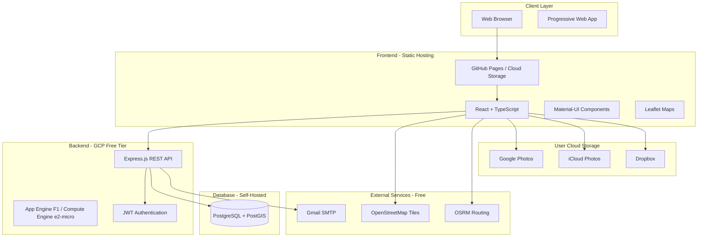
```mermaid
graph TB
    subgraph "Client Layer"
        Browser[Web Browser]
        PWA[Progressive Web App]
    end

    subgraph "Frontend - Static Hosting"
        GHP[GitHub Pages / Cloud Storage]
        React[React + TypeScript]
        MUI[Material-UI Components]
        Leaflet[Leaflet Maps]
    end

    subgraph "Backend - GCP Free Tier"
        AppEngine[App Engine F1 / Compute Engine e2-micro]
        API[Express.js REST API]
        Auth[JWT Authentication]
    end

    subgraph "Database - Self-Hosted"
        PG[(PostgreSQL + PostGIS)]
    end

    subgraph "External Services - Free"
        OSM[OpenStreetMap Tiles]
        OSRM[OSRM Routing]
        Gmail[Gmail SMTP]
    end

    subgraph "User Cloud Storage"
        GooglePhotos[Google Photos]
        iCloud[iCloud Photos]
        Dropbox[Dropbox]
    end

    Browser --> GHP
    GHP --> React
    React --> API
    API --> Auth
    API --> PG
    React --> OSM
    React --> OSRM
    API --> Gmail
    React --> GooglePhotos
    React --> iCloud
    React --> Dropbox
```

---

## Database Schema

### Core Tables

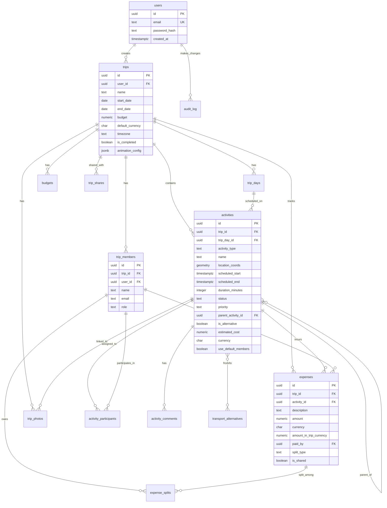
```mermaid
erDiagram
    users ||--o{ trips : creates
    users ||--o{ audit_log : makes_changes

    trips ||--o{ trip_days : has
    trips ||--o{ trip_members : has
    trips ||--o{ activities : contains
    trips ||--o{ expenses : tracks
    trips ||--o{ budgets : has
    trips ||--o{ trip_photos : has
    trips ||--o{ trip_shares : shared_with

    trip_days ||--o{ activities : scheduled_on

    activities ||--o{ activity_participants : assigned_to
    activities ||--o{ activity_comments : has
    activities ||--o{ trip_photos : linked_to
    activities ||--o{ expenses : incurs
    activities }o--o{ transport_alternatives : "from/to"
    activities ||--o{ activities : parent_of

    trip_members ||--o{ activity_participants : participates_in
    trip_members ||--o{ expenses : pays
    trip_members ||--o{ expense_splits : owes

    expenses ||--o{ expense_splits : split_among

    users {
        uuid id PK
        text email UK
        text password_hash
        timestamptz created_at
    }

    trips {
        uuid id PK
        uuid user_id FK
        text name
        date start_date
        date end_date
        numeric budget
        char default_currency
        text timezone
        boolean is_completed
        jsonb animation_config
    }

    activities {
        uuid id PK
        uuid trip_id FK
        uuid trip_day_id FK
        text activity_type
        text name
        geometry location_coords
        timestamptz scheduled_start
        timestamptz scheduled_end
        integer duration_minutes
        text status
        text priority
        uuid parent_activity_id FK
        boolean is_alternative
        numeric estimated_cost
        char currency
        boolean use_default_members
    }

    trip_members {
        uuid id PK
        uuid trip_id FK
        uuid user_id FK
        text name
        text email
        text role
    }

    expenses {
        uuid id PK
        uuid trip_id FK
        uuid activity_id FK
        text description
        numeric amount
        char currency
        numeric amount_in_trip_currency
        uuid paid_by FK
        text split_type
        boolean is_shared
    }
```

### Supporting Tables

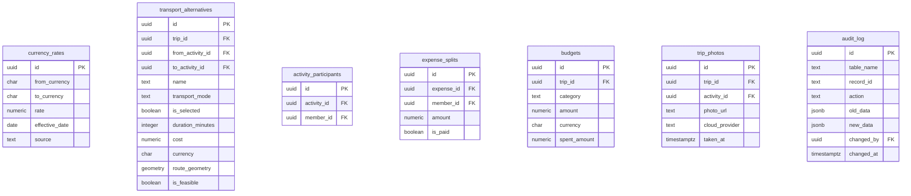
```mermaid
erDiagram
    currency_rates {
        uuid id PK
        char from_currency
        char to_currency
        numeric rate
        date effective_date
        text source
    }

    transport_alternatives {
        uuid id PK
        uuid trip_id FK
        uuid from_activity_id FK
        uuid to_activity_id FK
        text name
        text transport_mode
        boolean is_selected
        integer duration_minutes
        numeric cost
        char currency
        geometry route_geometry
        boolean is_feasible
    }

    activity_participants {
        uuid id PK
        uuid activity_id FK
        uuid member_id FK
    }

    expense_splits {
        uuid id PK
        uuid expense_id FK
        uuid member_id FK
        numeric amount
        boolean is_paid
    }

    budgets {
        uuid id PK
        uuid trip_id FK
        text category
        numeric amount
        char currency
        numeric spent_amount
    }

    trip_photos {
        uuid id PK
        uuid trip_id FK
        uuid activity_id FK
        text photo_url
        text cloud_provider
        timestamptz taken_at
    }

    audit_log {
        uuid id PK
        text table_name
        text record_id
        text action
        jsonb old_data
        jsonb new_data
        uuid changed_by FK
        timestamptz changed_at
    }
```

---

## Component Architecture

### Frontend Components

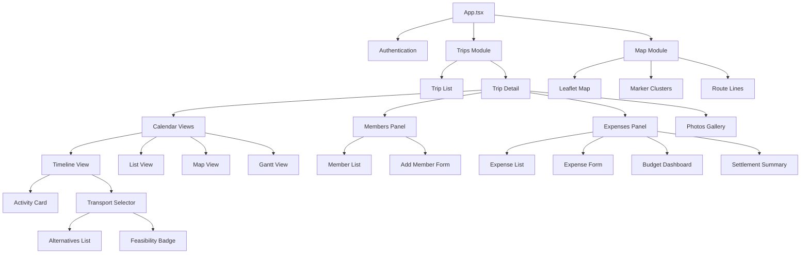
```mermaid
graph TD
    App[App.tsx]

    App --> Auth[Authentication]
    App --> Trips[Trips Module]
    App --> Map[Map Module]

    Trips --> TripList[Trip List]
    Trips --> TripDetail[Trip Detail]

    TripDetail --> Calendar[Calendar Views]
    TripDetail --> Members[Members Panel]
    TripDetail --> Expenses[Expenses Panel]
    TripDetail --> Photos[Photos Gallery]

    Calendar --> Timeline[Timeline View]
    Calendar --> ListView[List View]
    Calendar --> MapView[Map View]
    Calendar --> Gantt[Gantt View]

    Timeline --> ActivityCard[Activity Card]
    Timeline --> TransportSelector[Transport Selector]

    TransportSelector --> AlternativesList[Alternatives List]
    TransportSelector --> FeasibilityBadge[Feasibility Badge]

    Members --> MemberList[Member List]
    Members --> MemberForm[Add Member Form]

    Expenses --> ExpenseList[Expense List]
    Expenses --> ExpenseForm[Expense Form]
    Expenses --> BudgetDashboard[Budget Dashboard]
    Expenses --> SettlementSummary[Settlement Summary]

    Map --> MapComponent[Leaflet Map]
    Map --> MarkerClusters[Marker Clusters]
    Map --> RouteLines[Route Lines]
```

### Backend API Structure

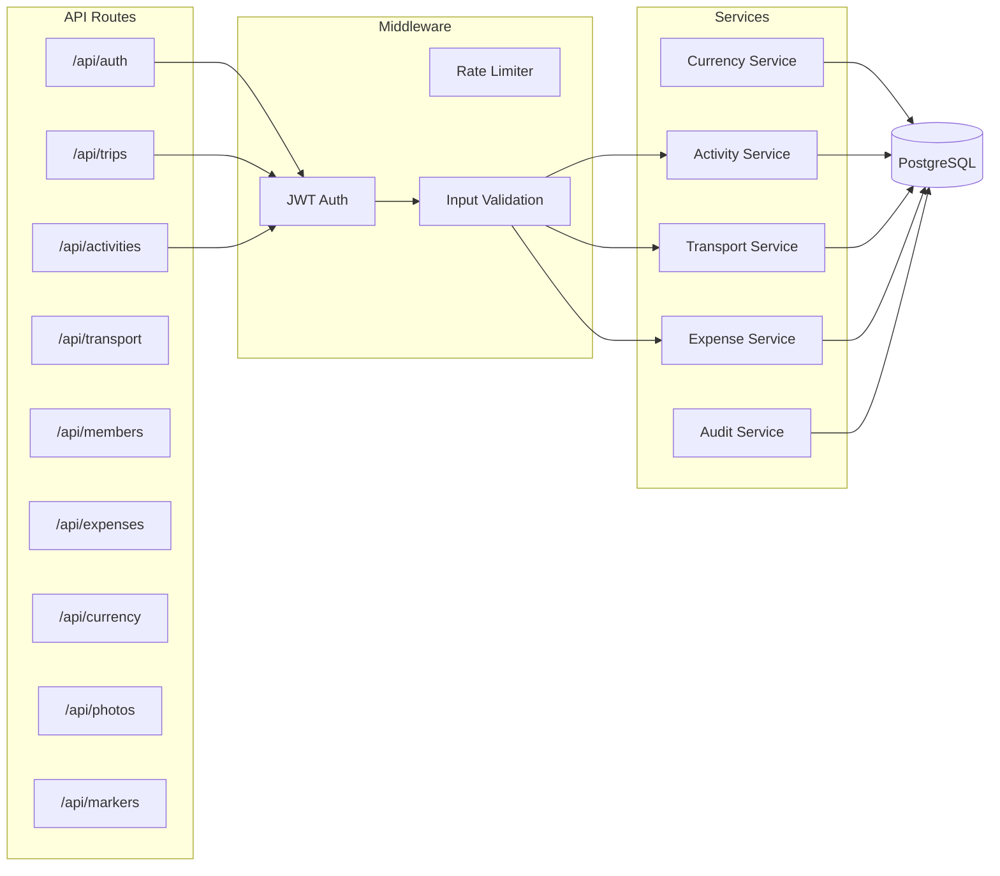
```mermaid
graph LR
    subgraph "API Routes"
        Auth["/api/auth"]
        Trips["/api/trips"]
        Activities["/api/activities"]
        Transport["/api/transport"]
        Members["/api/members"]
        Expenses["/api/expenses"]
        Currency["/api/currency"]
        Photos["/api/photos"]
        Markers["/api/markers"]
    end

    subgraph "Middleware"
        JWT["JWT Auth"]
        RateLimit["Rate Limiter"]
        Validation["Input Validation"]
    end

    subgraph "Services"
        ActivityService["Activity Service"]
        TransportService["Transport Service"]
        ExpenseService["Expense Service"]
        CurrencyService["Currency Service"]
        AuditService["Audit Service"]
    end

    Auth --> JWT
    Trips --> JWT
    Activities --> JWT

    JWT --> Validation
    Validation --> ActivityService
    Validation --> TransportService
    Validation --> ExpenseService

    CurrencyService --> DB[("PostgreSQL")]
    ActivityService --> DB
    TransportService --> DB
    ExpenseService --> DB
    AuditService --> DB
```

---

## Data Flow Diagrams

### Creating an Activity

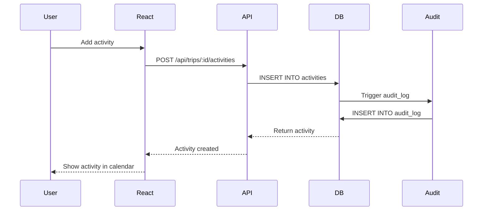
```mermaid
sequenceDiagram
    participant User
    participant React
    participant API
    participant DB
    participant Audit

    User->>React: Add activity
    React->>API: POST /api/trips/:id/activities
    API->>DB: INSERT INTO activities
    DB->>Audit: Trigger audit_log
    Audit->>DB: INSERT INTO audit_log
    DB-->>API: Return activity
    API-->>React: Activity created
    React-->>User: Show activity in calendar
```

### Adding Transport Alternative

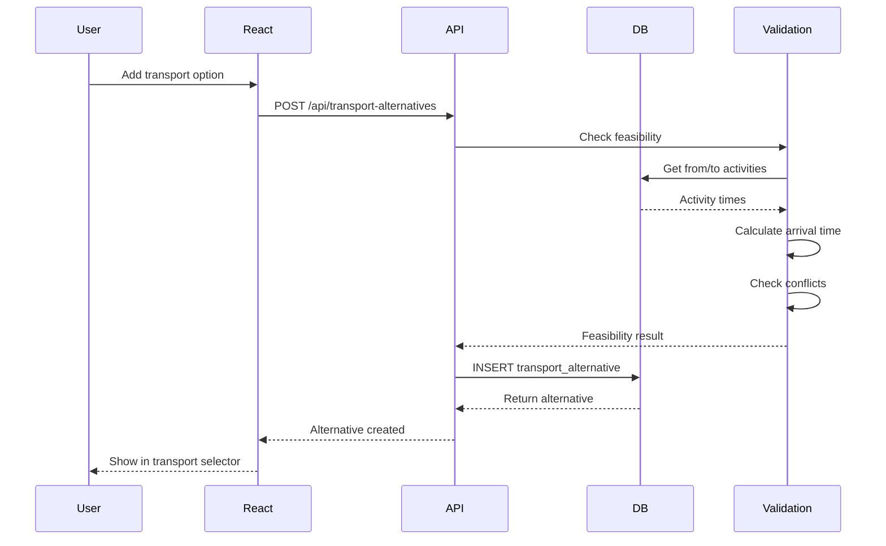
```mermaid
sequenceDiagram
    participant User
    participant React
    participant API
    participant DB
    participant Validation

    User->>React: Add transport option
    React->>API: POST /api/transport-alternatives
    API->>Validation: Check feasibility
    Validation->>DB: Get from/to activities
    DB-->>Validation: Activity times
    Validation->>Validation: Calculate arrival time
    Validation->>Validation: Check conflicts
    Validation-->>API: Feasibility result
    API->>DB: INSERT transport_alternative
    DB-->>API: Return alternative
    API-->>React: Alternative created
    React-->>User: Show in transport selector
```

### Currency Conversion

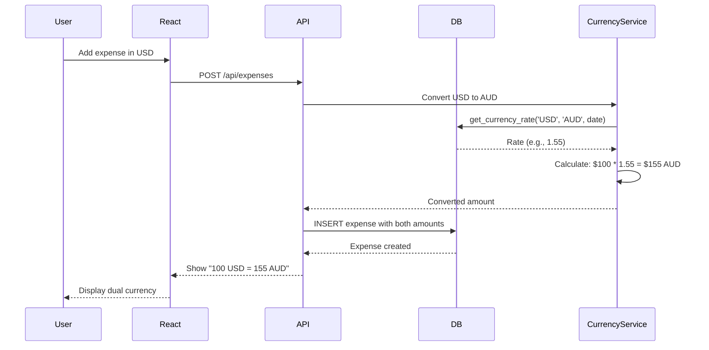
```mermaid
sequenceDiagram
    participant User
    participant React
    participant API
    participant DB
    participant CurrencyService

    User->>React: Add expense in USD
    React->>API: POST /api/expenses
    API->>CurrencyService: Convert USD to AUD
    CurrencyService->>DB: get_currency_rate('USD', 'AUD', date)
    DB-->>CurrencyService: Rate (e.g., 1.55)
    CurrencyService->>CurrencyService: Calculate: $100 * 1.55 = $155 AUD
    CurrencyService-->>API: Converted amount
    API->>DB: INSERT expense with both amounts
    DB-->>API: Expense created
    API-->>React: Show "100 USD = 155 AUD"
    React-->>User: Display dual currency
```

### Expense Splitting

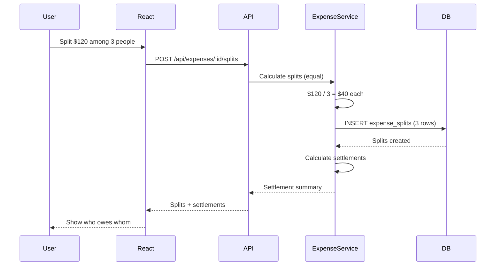
```mermaid
sequenceDiagram
    participant User
    participant React
    participant API
    participant ExpenseService
    participant DB

    User->>React: Split $120 among 3 people
    React->>API: POST /api/expenses/:id/splits
    API->>ExpenseService: Calculate splits (equal)
    ExpenseService->>ExpenseService: $120 / 3 = $40 each
    ExpenseService->>DB: INSERT expense_splits (3 rows)
    DB-->>ExpenseService: Splits created
    ExpenseService->>ExpenseService: Calculate settlements
    ExpenseService-->>API: Settlement summary
    API-->>React: Splits + settlements
    React-->>User: Show who owes whom
```

---

## Deployment Architecture

### GCP Free Tier Setup

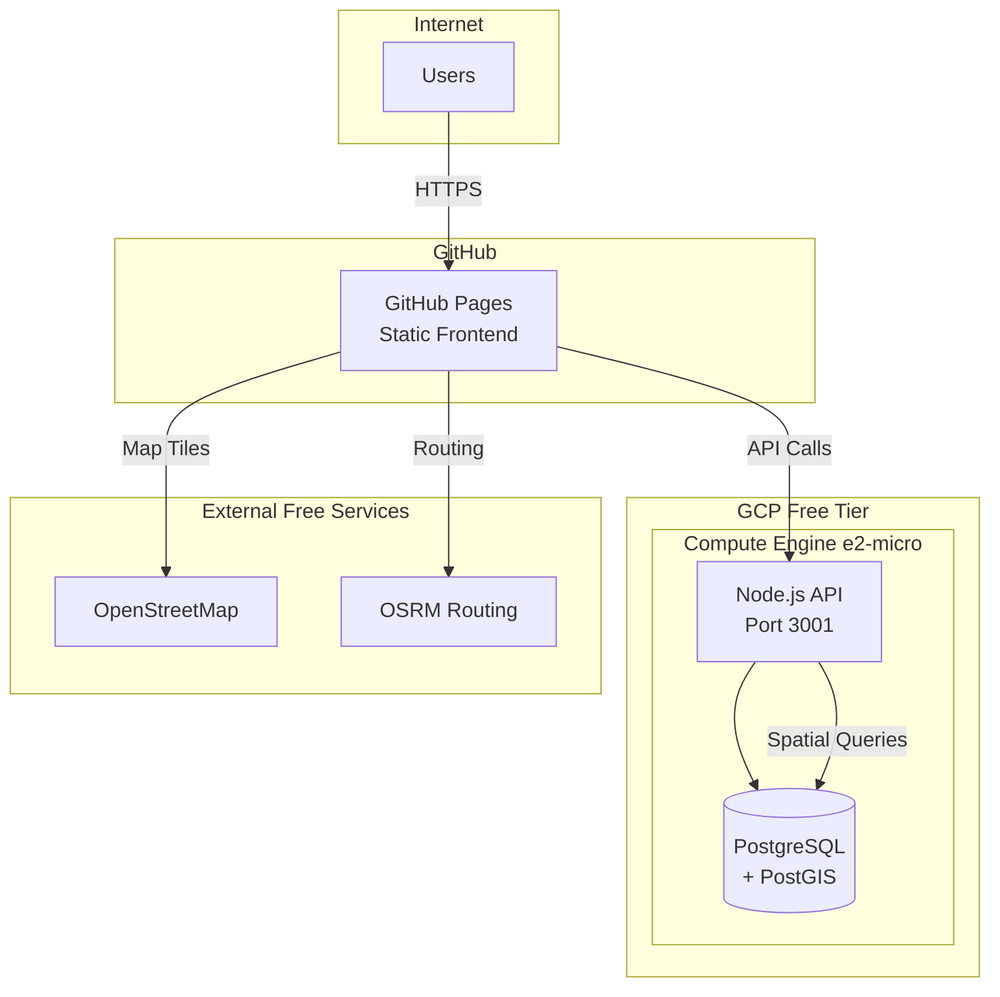
```mermaid
graph TB
    subgraph "Internet"
        Users[Users]
    end

    subgraph "GitHub"
        GHP[GitHub Pages<br/>Static Frontend]
    end

    subgraph "GCP Free Tier"
        subgraph "Compute Engine e2-micro"
            Backend[Node.js API<br/>Port 3001]
            PG[(PostgreSQL<br/>+ PostGIS)]
        end
    end

    subgraph "External Free Services"
        OSM[OpenStreetMap]
        OSRM[OSRM Routing]
    end

    Users -->|HTTPS| GHP
    GHP -->|API Calls| Backend
    Backend --> PG
    GHP -->|Map Tiles| OSM
    GHP -->|Routing| OSRM
    Backend -->|Spatial Queries| PG
```

### Alternative: App Engine Deployment

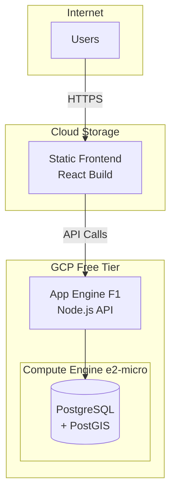
```mermaid
graph TB
    subgraph "Internet"
        Users[Users]
    end

    subgraph "Cloud Storage"
        Static[Static Frontend<br/>React Build]
    end

    subgraph "GCP Free Tier"
        AppEngine[App Engine F1<br/>Node.js API]

        subgraph "Compute Engine e2-micro"
            PG[(PostgreSQL<br/>+ PostGIS)]
        end
    end

    Users -->|HTTPS| Static
    Static -->|API Calls| AppEngine
    AppEngine --> PG
```

---

## Security Architecture

### Authentication Flow

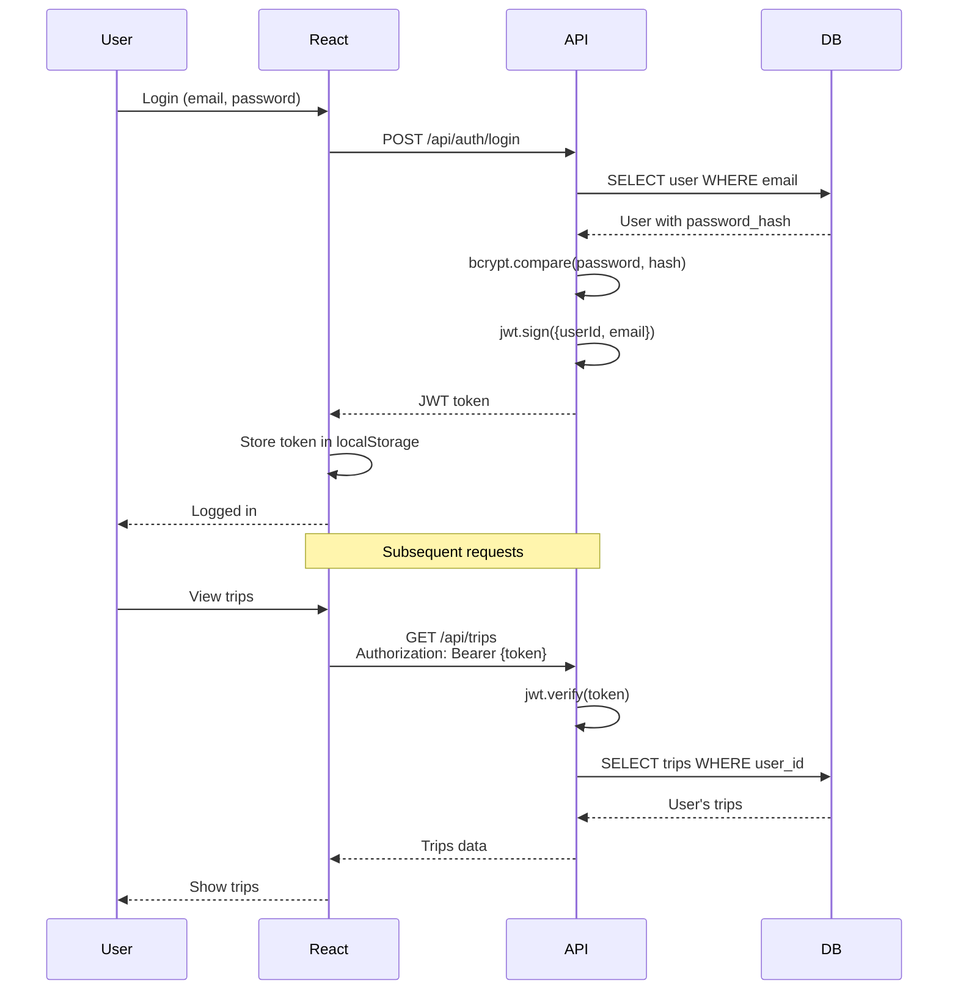
```mermaid
sequenceDiagram
    participant User
    participant React
    participant API
    participant DB

    User->>React: Login (email, password)
    React->>API: POST /api/auth/login
    API->>DB: SELECT user WHERE email
    DB-->>API: User with password_hash
    API->>API: bcrypt.compare(password, hash)
    API->>API: jwt.sign({userId, email})
    API-->>React: JWT token
    React->>React: Store token in localStorage
    React-->>User: Logged in

    Note over React,API: Subsequent requests

    User->>React: View trips
    React->>API: GET /api/trips<br/>Authorization: Bearer {token}
    API->>API: jwt.verify(token)
    API->>DB: SELECT trips WHERE user_id
    DB-->>API: User's trips
    API-->>React: Trips data
    React-->>User: Show trips
```

### Authorization Levels

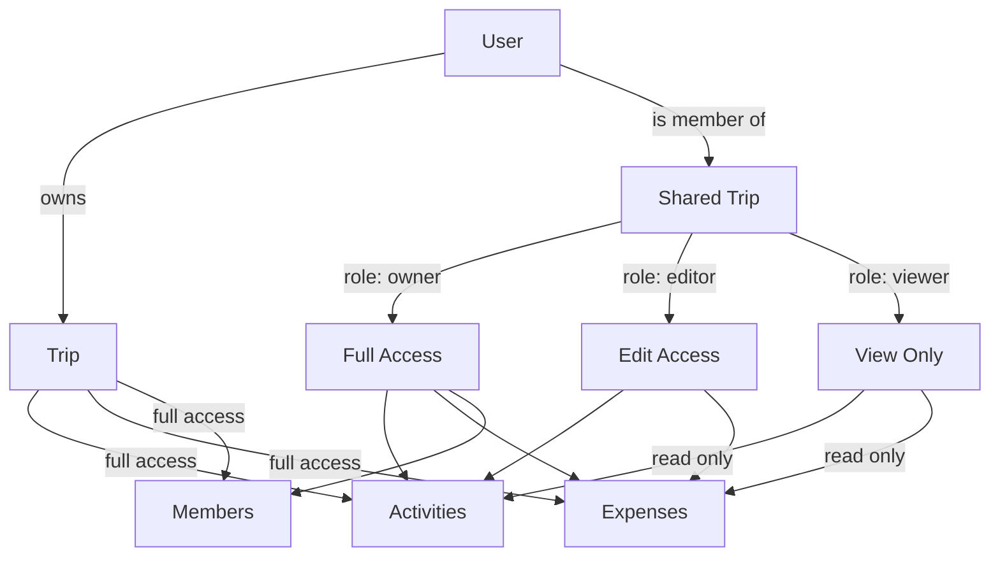
```mermaid
graph TD
    User[User]

    User -->|owns| Trip[Trip]
    User -->|is member of| SharedTrip[Shared Trip]

    Trip -->|full access| Activities[Activities]
    Trip -->|full access| Expenses[Expenses]
    Trip -->|full access| Members[Members]

    SharedTrip -->|role: owner| FullAccess[Full Access]
    SharedTrip -->|role: editor| EditAccess[Edit Access]
    SharedTrip -->|role: viewer| ViewAccess[View Only]

    FullAccess --> Activities
    FullAccess --> Expenses
    FullAccess --> Members

    EditAccess --> Activities
    EditAccess --> Expenses

    ViewAccess -->|read only| Activities
    ViewAccess -->|read only| Expenses
```

---

## Performance Optimizations

### Marker Loading Strategy

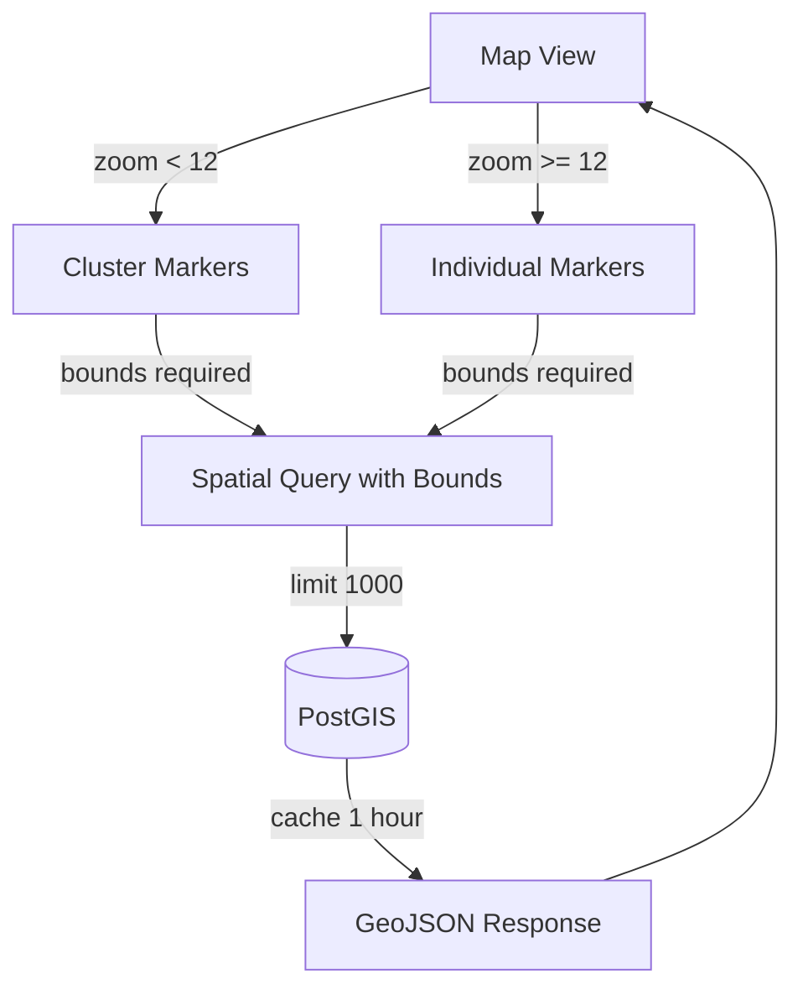
```mermaid
graph TD
    MapView[Map View]

    MapView -->|zoom < 12| Clustering[Cluster Markers]
    MapView -->|zoom >= 12| Individual[Individual Markers]

    Clustering -->|bounds required| SpatialQuery[Spatial Query with Bounds]
    Individual -->|bounds required| SpatialQuery

    SpatialQuery -->|limit 1000| DB[(PostGIS)]

    DB -->|cache 1 hour| Response[GeoJSON Response]

    Response --> MapView
```

### Database Indexing Strategy

```sql
-- Spatial indexes (GIST)
CREATE INDEX idx_activities_location ON activities USING GIST(location_coords);
CREATE INDEX idx_transport_route ON transport_alternatives USING GIST(route_geometry);

-- Array indexes (GIN)
CREATE INDEX idx_activities_tags ON activities USING GIN(tags);

-- Partial indexes
CREATE INDEX idx_transport_selected ON transport_alternatives(is_selected)
  WHERE is_selected = TRUE;

-- Composite indexes
CREATE INDEX idx_activities_trip_day ON activities(trip_id, trip_day_id);
CREATE INDEX idx_expenses_trip_category ON expenses(trip_id, category);
```

---

## Offline Support

### Progressive Web App Architecture

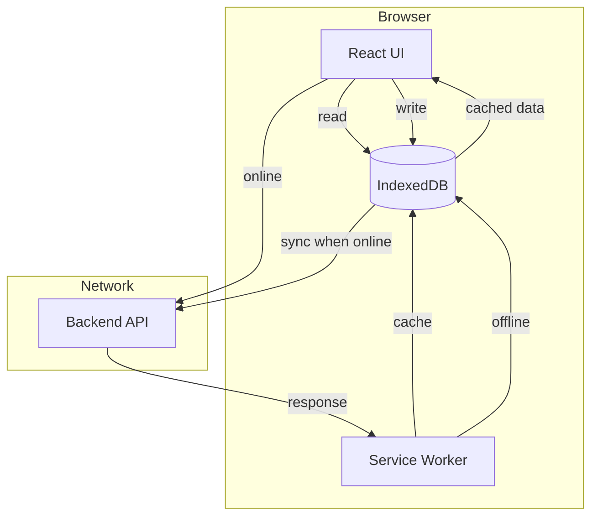
```mermaid
graph TB
    subgraph "Browser"
        UI[React UI]
        SW[Service Worker]
        IDB[(IndexedDB)]
    end

    subgraph "Network"
        API[Backend API]
    end

    UI -->|read| IDB
    UI -->|write| IDB

    UI -->|online| API
    API -->|response| SW
    SW -->|cache| IDB

    SW -->|offline| IDB
    IDB -->|cached data| UI

    IDB -->|sync when online| API
```

### Sync Strategy

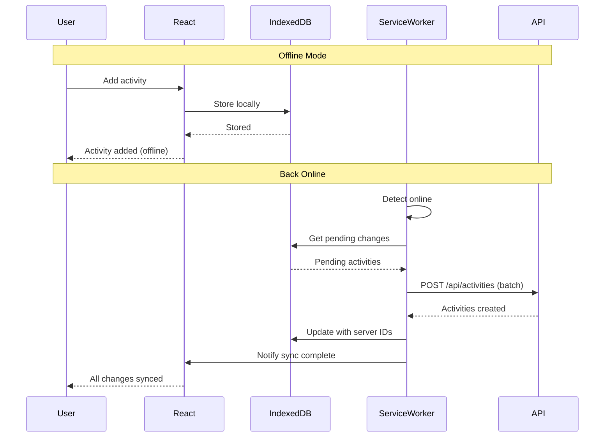
```mermaid
sequenceDiagram
    participant User
    participant React
    participant IndexedDB
    participant ServiceWorker
    participant API

    Note over User,API: Offline Mode

    User->>React: Add activity
    React->>IndexedDB: Store locally
    IndexedDB-->>React: Stored
    React-->>User: Activity added (offline)

    Note over User,API: Back Online

    ServiceWorker->>ServiceWorker: Detect online
    ServiceWorker->>IndexedDB: Get pending changes
    IndexedDB-->>ServiceWorker: Pending activities
    ServiceWorker->>API: POST /api/activities (batch)
    API-->>ServiceWorker: Activities created
    ServiceWorker->>IndexedDB: Update with server IDs
    ServiceWorker->>React: Notify sync complete
    React-->>User: All changes synced
```

---

## Monitoring & Logging

### Application Logging

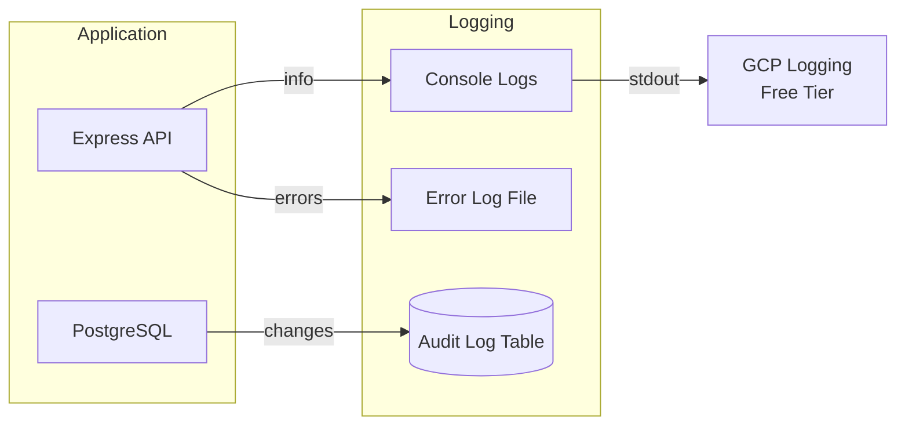
```mermaid
graph LR
    subgraph "Application"
        API[Express API]
        DB[PostgreSQL]
    end

    subgraph "Logging"
        Console[Console Logs]
        AuditLog[(Audit Log Table)]
        ErrorLog[Error Log File]
    end

    API -->|info| Console
    API -->|errors| ErrorLog
    DB -->|changes| AuditLog

    Console -->|stdout| GCP[GCP Logging<br/>Free Tier]
```

### Health Checks

```typescript
// Health check endpoint
app.get("/health", async (req, res) => {
  try {
    // Check database
    await query("SELECT 1")

    res.json({
      status: "healthy",
      timestamp: new Date().toISOString(),
      database: "connected",
      uptime: process.uptime(),
    })
  } catch (err) {
    res.status(503).json({
      status: "unhealthy",
      error: err.message,
    })
  }
})
```

---

## Scalability Considerations

### Current Limits (Family Use)

- **Users**: 4-10 people
- **Trips**: 2-3 per year
- **Activities**: ~100 per trip
- **Photos**: Unlimited (via links)
- **Expenses**: ~50 per trip

### If Scaling Needed (Future)

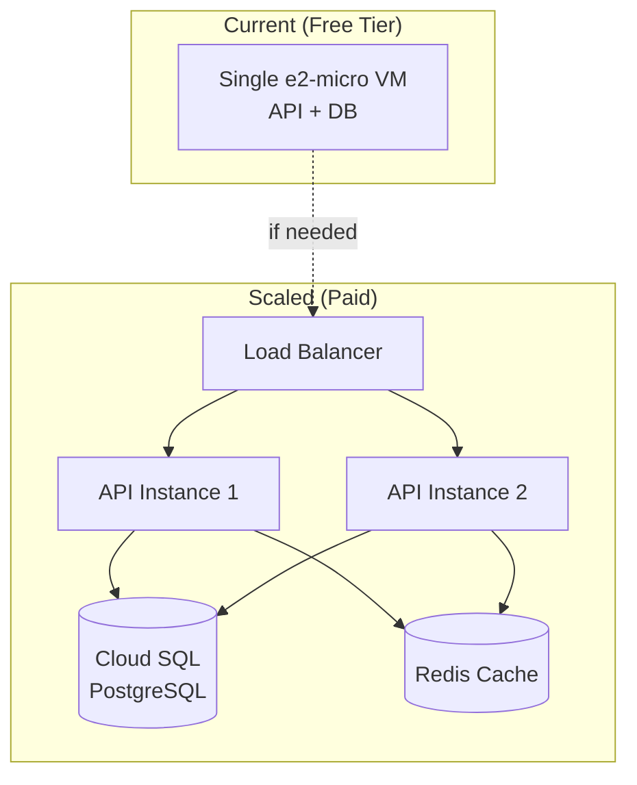
```mermaid
graph TB
    subgraph "Current (Free Tier)"
        Single[Single e2-micro VM<br/>API + DB]
    end

    subgraph "Scaled (Paid)"
        LB[Load Balancer]
        API1[API Instance 1]
        API2[API Instance 2]
        CloudSQL[(Cloud SQL<br/>PostgreSQL)]
        Redis[(Redis Cache)]
    end

    Single -.->|if needed| LB
    LB --> API1
    LB --> API2
    API1 --> CloudSQL
    API2 --> CloudSQL
    API1 --> Redis
    API2 --> Redis
```

---

## Technology Stack Summary

### Frontend

- **Framework**: React 18 + TypeScript
- **UI Library**: Material-UI (MUI)
- **Maps**: Leaflet + OpenStreetMap
- **Charts**: Chart.js
- **State**: React Context API
- **HTTP**: Axios
- **Build**: Vite
- **Hosting**: GitHub Pages (free)

### Backend

- **Runtime**: Node.js 18+
- **Framework**: Express.js
- **Database**: PostgreSQL 15 + PostGIS
- **Authentication**: JWT + bcrypt
- **Validation**: Zod (planned)
- **Hosting**: Compute Engine e2-micro (free)

### External Services (Free)

- **Maps**: OpenStreetMap
- **Routing**: OSRM
- **Email**: Gmail SMTP
- **Photos**: User's cloud storage (links only)

---

## Cost Breakdown

### Monthly Costs

| Service                           | Usage        | Cost         |
| --------------------------------- | ------------ | ------------ |
| Frontend (GitHub Pages)           | Unlimited    | $0           |
| Backend (Compute Engine e2-micro) | 1 instance   | $0           |
| Database (PostgreSQL on VM)       | Self-hosted  | $0           |
| Bandwidth (1 GB/day)              | ~30 GB/month | $0           |
| Storage (no photos)               | Minimal      | $0           |
| **Total**                         |              | **$0/month** |

### Resource Usage (Family)

- **API Requests**: ~1,000/day during planning
- **Database Size**: ~100 MB
- **Bandwidth**: ~100 MB/day
- **Compute**: ~2 hours/day

**All within GCP Always Free tier limits!**

---

**Last Updated**: 2025-12-03  
**Version**: 2.0 (Final)
